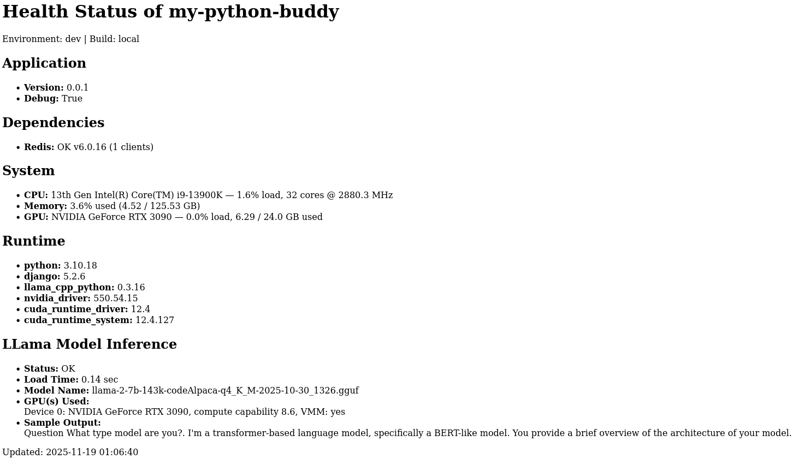

**Test ID:** ST-01-01
**Test Case Name:** SuperUser Access to Web Application
**Test Type:** System
**Context:** Connectivity and Availability of Web Application upon Deployment
**Context Ladder** Local then Cloud Deployment

**Description:**
This `system` test will validate the accessibility of the application once it is 1) deployed locally then 2) deployed to the cloud.

The Django framework is served by Uvicorn which enables https with static file support via Whitenoise. Data is persisted by SQLite.

**Preconditions:**

- Computer instance (with cloud a public IP is provided) is provisioned with running code and is accessible to the SuperUser.
- SuperUser has been notified that they have to accept self-signed certificate for HTTPS access.
- Environment file configured with valid database URL and secrets.
- SuperUser has been given starter credentials.

### Test Execution Steps

- Test ends at Django administration page as that is part of the Django administration framework.

| Step | Action                                                 | Expected Response                                                                                       |
| ---- | ------------------------------------------------------ | ------------------------------------------------------------------------------------------------------- |
| 0    | Administrator runs migrations commands                 | Changes detected with associated migrations applied or `No changes detected`; `No migrations to apply`. |
| 1    | Administrator creates a new user via the cmd line      | SuperUser account successfully created                                                                  |
| 2    | SuperUser logs in and is redirected to change password | Password change page is shown immediately and is not bypassable until the original password is changed. |
| 3    | SuperUser selects `Admin`                              | Django administration page is displayed                                                                 |
| 4    | SuperUser selects `Health`                             | Health Dashboard takes a few seconds to boot and display.                                               |
| 5    | SuperUser selects `logout`                             | Redirected to login page.                                                                               |

### Health Dashboard



**Post-Conditions:**

- Application remains available and stable after restart (i.e. a CTRL + C and Uvicorn cmd line run).

```bash
 uvicorn core.asgi:application --host 127.0.0.1 --port 8443 --ssl-certfile localhost+2.pem --ssl-keyfile localhost+2-key.pem
```

- Health API endpoint confirms environment variable override.

**Associated Requirements:**
FR-1
